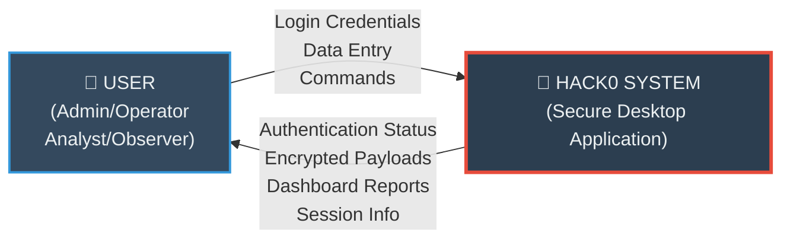
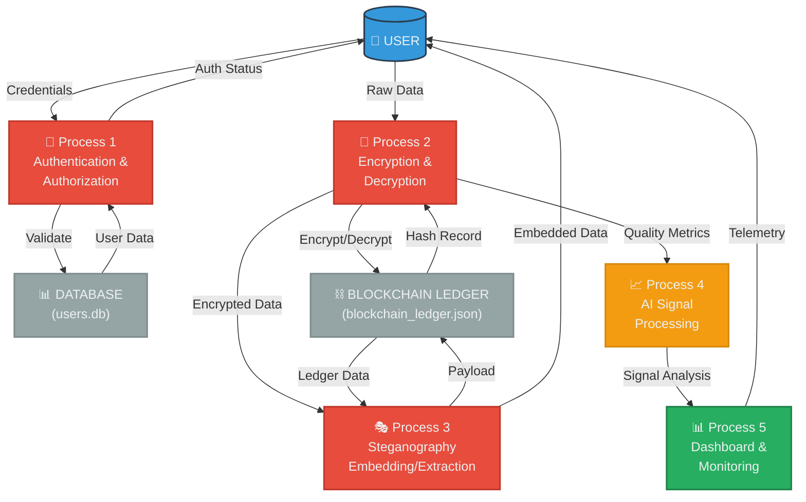
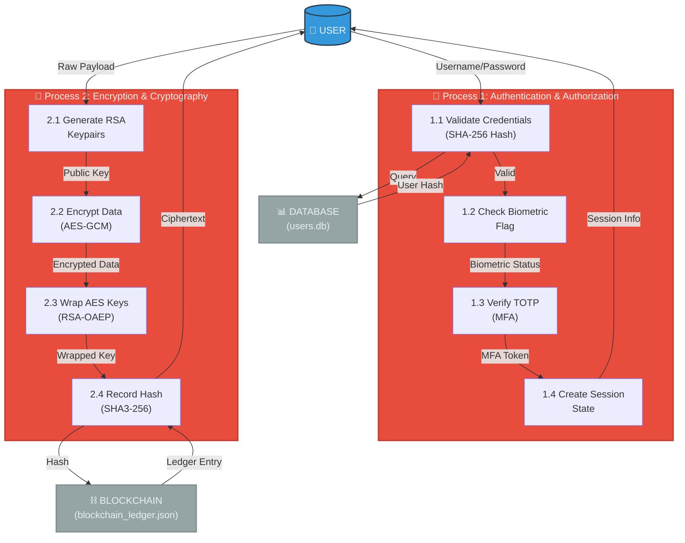
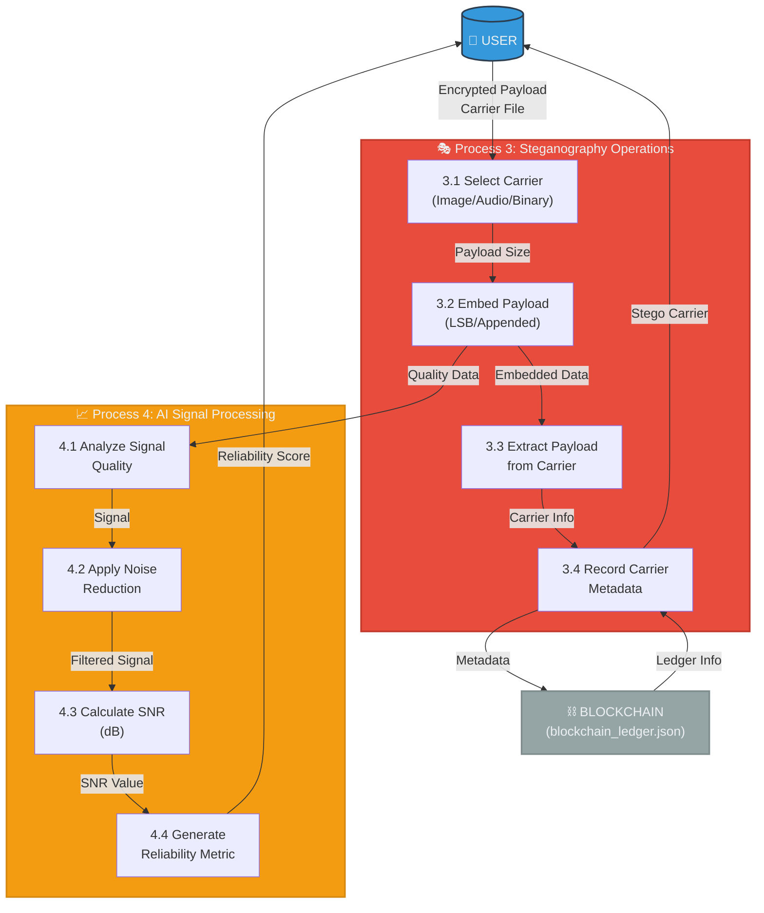

# Hack0 Project Architecture & Capabilities Report

## 1. Executive Summary
Hack0 is a robust, secure, role-based desktop application built using Python and PyQt5. The application is designed to operate securely even in offline or compromised environments by implementing military-grade cryptography, hybrid authentication pipelines (online/offline), telemetry monitoring, steganography (data hiding), and AI-assisted signal correction. 

## 2. Security & Authentication Architecture
The core authentication system utilizes a robust step-up approach, relying on a localized SQLite database (`users.db`) to allow true offline operation.

*   **Primary Authentication**: SHA-256 hashed passwords matching against the SQLite database.
*   **Time-based One-Time Password (TOTP)**: Integration with `pyotp` provides second-factor authentication without requiring internet connectivity.
*   **Biometric Simulations**: Biometric validation flags (`has_biometric`) mimic advanced login systems (e.g., facial recognition integration module).
*   **Emergency Access**: A localized override code (`999999`) exists for catastrophic offline scenarios.
*   **Session Management**: A robust `session.py` architecture maintains state vectors (e.g., `is_mfa_verified`, `is_biometric_verified`, `step_up_cache`) ensuring authorization continuity across restricted windows.

## 3. Role-Based Access Control (RBAC)
The application dynamically injects and hides UI elements according to the Principle of Least Privilege. Actions available to users are strictly gated:

*   **Admin**: Total system oversight. Controls role assignment, user management, and has access to all functional modules including `Manage Roles` and profile configuration.
*   **Operator**: Tasked with active deployment. Can execute **Data Entry** and **Recovery** pipelines, but cannot access system monitoring or QR generation modules.
*   **Analyst**: Tasked with intelligence and extraction. Can access **Recovery** and **Monitoring** (QR Generation), but cannot process primary Data Entry.
*   **Observer**: Strictly read-only monitoring. Denied access to Data Entry, Recovery, and the monitoring interactive tabs. Access is limited to live System Telemetry graphs.

## 4. Cryptographic Pipeline (`crypto.py`)
Hack0 implements a dual-layer cryptographic envelope designed to protect state-secrets at rest and in transit.

*   **Asymmetric Root**: RSA (2048-bit) keypairs are generated and formatted via PKCS8 (PEM) encoding. 
*   **Symmetric Workload**: AES-GCM (Galois/Counter Mode) handles high-speed, authenticated symmetric encryption for the main data payloads. 
*   **Key Wrapping**: AES symmetric keys are securely encrypted using the destination's RSA public key with OAEP padding and SHA-256 hashing format, preventing man-in-the-middle attacks on the cryptographic keys themselves. 

## 5. Steganography Engine (`stego.py`)
Provides advanced capability to securely exfiltrate or hide encrypted payloads within seemingly innocuous carrier files (Images, Audio, General Data).

*   **Image Carrier (LSB)**: Embeds binary payloads into the Least Significant Bits of PNG files without noticeably distorting visual fidelity.
*   **Audio Carrier (LSB)**: Modifies WAV files leveraging the `librosa` library, embedding ciphertexts within the low-level frequency samples.
*   **Generic Appended Carrier**: For massive payloads, the engine bypasses fragile LSB processing and securely appends payloads to the raw binary strings of executables or PDFs, separated by a proprietary marker (`<<HACK0_MARKER>>`).

## 6. Artificial Intelligence Engine (`ai/ai.py`)
AI modules optimize data embedding quality and retrieve corrupted signals during degraded system transmission operations.

*   **AI Noise Reduction**: Utilizes `librosa` Spectral Gating to mock noise filtering algorithms specifically tuned to preserve underlying structural data heuristics.
*   **Signal Quality Analytics**: Calculates realistic Signal-to-Noise Ratio (SNR) in dB, generating a `decoding_reliability` metric for analysts.
*   **Dynamic Payload Recommendations**: Heuristics analyzer maps exact byte weights of payload requests and automatically selects the safest steganographic medium (e.g., Raw Binary/PNG for small payloads; Appended Binary for >10kb to >500kb payloads) to prevent carrier corruption.

## 7. Blockchain Tamper-Resistance (`blockchain.py`)
To prevent internal tampering of cryptographic records, the app leverages a localized JSON-based ledger (`blockchain_ledger.json`). 

*   **Algorithmic Hashing**: Every critical artifact generates a deterministic SHA3-256 hash. 
*   **Immutable Tracking**: Hashes are written against UTC timestamps in a linear chain validation system. Any external modification to the local data breaks the internal chain validation.

## 8. Telemetry & User Interface (`dashboard_window.py`)
The main Command Center dynamically represents critical operations data.

*   **System Tracking**: Hooks into the native OS via `psutil` to graph live CPU and RAM consumption data through `pyqtgraph`.
*   **Metric Synthesis**: Continuously aggregates SQLite user counts, BlockChain ledger verification length, and recent system activities into live-rendering 2x2 multi-plots.
*   **Theming**: Entire application benefits from a custom-designed dark Qt theme prioritizing contrast and military-grade UI aesthetics with clear error handling states.

## 9. Class Diagram

A Class Diagram is a static UML diagram that represents the structure of a system. It shows the 
classes, their attributes, methods, and the relationships between them. 

Each class is represented by a rectangle divided into three parts: class name, attributes, and 
operations. It helps in understanding how different parts of the system are organized and how 
they interact with each other. 

Class diagrams are widely used in object-oriented system design because they can be directly 
mapped to programming languages. They also show relationships such as association, 
inheritance, aggregation, and dependency. 

In this project, classes like Auth, Crypto, Stego, Blockchain, AI, Session, and various Window classes (e.g., LoginWindow, DashboardWindow) are included to represent 
the structure of the Hack0 Secure Desktop Application.

## 10. Activity Diagram

Initial node 

Final node 

Decision node 

Control Flow 

Activity 

Activity diagrams are graphical representations of workflows of step wise activities and actions 
with support for choice, iteration and concurrency. In the Unified Modelling Language, activity 
diagrams can be used to describe the business and operational step-by-step workflows of 
components in a system. An activity diagram shows the overall flow of control. In the Hack0 Secure Desktop Application, activity diagrams illustrate key processes such as user authentication (including credential validation and MFA), data encryption and steganography embedding, and system monitoring workflows, highlighting decision points for security checks and concurrent operations like AI-assisted signal correction. 

Fork. 

Join. 

In this project, the activity diagram illustrates the authentication workflow in the Hack0 Secure Desktop Application, showing the step-by-step process from user login to accessing the dashboard.

### Diagram:

### Elements Used in the Diagram and Their Representations:

- **Initial Node**: Represented by a filled black circle (●). It marks the starting point of the activity diagram. In the diagram, "Start" is the initial node.
- **Final Node**: Represented by a bullseye (● with a circle around it). It indicates the end of the activity. In the diagram, "End" is the final node.
- **Decision Node**: Represented by a diamond shape (◇). It shows a branching point where a choice is made based on a condition. In the diagram, "Validate credentials" and "Validate MFA" are decision nodes.
- **Control Flow**: Represented by solid arrows (→). They show the sequence of activities and the flow of control from one element to another.
- **Activity**: Represented by rectangles with rounded corners. They depict the actions or tasks performed in the workflow. Examples include "User enters credentials", "Proceed to MFA", "Login successful", etc.
- **Fork**: Not used in this diagram, but would be represented by a thick horizontal or vertical bar to split the flow into concurrent paths.
- **Join**: Not used in this diagram, but would be represented by a thick horizontal or vertical bar to merge concurrent paths back into a single flow.

## 11. Data Flow Diagram

A Data Flow Diagram (DFD) is a diagram that describes the flow of data and the processes that 
change data throughout a system. It's a structured analysis and design tool that can be used for 
flowcharting in place of or in association with information-oriented and process-oriented system 
flowcharts. When analysts prepare the Data Flow Diagram, they specify the user needs at a level 
of detail that virtually determines the information flow into and out of the system and the required 
data resources. This network is constructed by using a set of symbols that do not imply physical 
implementations. The Data Flow Diagram reviews the current system architecture, prepares input 
and output specifications, specifies the implementation plan, etc. 

Four basic symbols are used to construct data flow diagrams:
- **Source or Destination of Data**: Represented by rectangles. External entities that produce or consume data.
- **Data Flow**: Represented by arrows. Shows the movement of data between processes and data stores.
- **Process**: Represented by circles or rounded rectangles. Transforms input data into output data.
- **Storage**: Represented by two parallel lines. Stores data for later retrieval (databases, ledgers).

### Steps to Construct Data Flow Diagrams:
- Processes should be named and numbered for easy reference.
- Each name should be representative of the process.
- The direction of flow is from top to bottom and from left to right.
- When a process is exploded into lower-level details, they are numbered accordingly.
- The names of data stores, sources, and destinations are written in capital letters.

In the Hack0 Secure Desktop Application, the DFD illustrates how user credentials flow through authentication, how data is encrypted and embedded in steganographic carriers, and how the blockchain ledger maintains tamper-resistant records. The system processes handle secure credential validation, cryptographic operations, steganographic embedding/extraction, and telemetry data collection for monitoring.

### 11.1 Context Diagram (0th Level)

The context diagram represents the entire Hack0 system as a single process and shows how it interacts with external entities.

### 11.2 First Level DFD (1st Level)

The first level breaks down the system into major processes and shows data flow between them.

### 11.3 Second Level DFD (2nd Level) - Authentication & Encryption Detail

This diagram expands on the Authentication and Encryption processes.

### 11.4 Second Level DFD (2nd Level) - Steganography & AI Processing

This diagram expands on the Steganography and AI Signal Processing operations.

### 11.5 DFD Symbol Definitions for Hack0:

| Symbol | Name | Description |
|--------|------|-------------|
| Rectangle | External Entity | Users (Admin, Operator, Analyst, Observer) or external systems |
| Circle/Process | Process | Operations like Authentication (P1), Encryption (P2), Steganography (P3), AI Processing (P4), Monitoring (P5) |
| Parallel Lines | Data Store | Database (users.db), Blockchain Ledger (blockchain_ledger.json) |
| Arrow | Data Flow | Movement of credentials, encrypted data, payloads, session info, telemetry |
